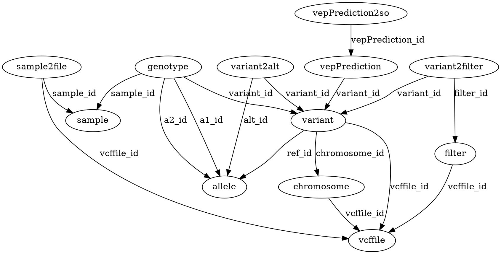

# VcfToSql

Generate the SQL code to insert a VCF into mysql


## Usage

```
Usage: vcf2sql [options] Files
  Options:
    -d, --drop
      Add Drop Tables Statement
      Default: false
    -h, --help
      print help and exit
    --helpFormat
      What kind of help
      Possible Values: [usage, markdown, xml]
    -f, --nofilter
      ignore FILTER column
      Default: false
    -n, --noinfo
      ignore INFO column
      Default: false
    -o, --output
      Output file. Optional . Default: stdout
    -s, --schema
      Print Schema
      Default: false
    --version
      print version and exit

```


## Keywords

 * vcf
 * sql


## Compilation

### Requirements / Dependencies

* java [compiler SDK 1.8](http://www.oracle.com/technetwork/java/index.html) (**NOT the old java 1.7 or 1.6**) and avoid OpenJdk, use the java from Oracle. Please check that this java is in the `${PATH}`. Setting JAVA_HOME is not enough : (e.g: https://github.com/lindenb/jvarkit/issues/23 )
* GNU Make >= 3.81
* curl/wget
* git
* xsltproc http://xmlsoft.org/XSLT/xsltproc2.html (tested with "libxml 20706, libxslt 10126 and libexslt 815")


### Download and Compile

```bash
$ git clone "https://github.com/lindenb/jvarkit.git"
$ cd jvarkit
$ make vcf2sql
```

The *.jar libraries are not included in the main jar file, [so you shouldn't move them](https://github.com/lindenb/jvarkit/issues/15#issuecomment-140099011 ).
The required libraries will be downloaded and installed in the `dist` directory.

Experimental: you can also create a [fat jar](https://stackoverflow.com/questions/19150811/) which contains classes from all the libraries, on which your project depends (it's bigger). Those fat-jar are generated by adding `standalone=yes` to the gnu make command, for example ` make vcf2sql standalone=yes`.

### edit 'local.mk' (optional)

The a file **local.mk** can be created edited to override/add some definitions.

For example it can be used to set the HTTP proxy:

```
http.proxy.host=your.host.com
http.proxy.port=124567
```
## Source code 

[https://github.com/lindenb/jvarkit/tree/master/src/main/java/com/github/lindenb/jvarkit/tools/vcf2sql/VcfToSql.java](https://github.com/lindenb/jvarkit/tree/master/src/main/java/com/github/lindenb/jvarkit/tools/vcf2sql/VcfToSql.java)


<details>
<summary>Git History</summary>

```
Mon May 29 12:33:45 2017 +0200 ; cont ; https://github.com/lindenb/jvarkit/commit/870be8e90d7e98d947f73e67ef9965f12f351846
Mon May 22 17:20:59 2017 +0200 ; moving to jcommaner ; https://github.com/lindenb/jvarkit/commit/60cbfa764f7f5bacfdb78e48caf8f9b66e53a6a0
Fri Apr 14 10:22:16 2017 +0200 ; knime helper ; https://github.com/lindenb/jvarkit/commit/51679edcfb691b8851c06881599c6f1c7a65af34
Wed Feb 22 19:07:03 2017 +0100 ; refactor prediction parsers ; https://github.com/lindenb/jvarkit/commit/dc7f7797c60d63cd09d3b7712fb81033cd7022cb
Tue Feb 14 16:40:50 2017 +0100 ; ngs files ; https://github.com/lindenb/jvarkit/commit/4762c08811ff316f00f3b3151cdce9cd3dcfdeb0
Fri Jun 17 13:56:39 2016 +0200 ; cont ; https://github.com/lindenb/jvarkit/commit/865252a44fc018f46b4280788cec65a1383dcc18
Thu Nov 26 17:41:15 2015 +0100 ; cont ; https://github.com/lindenb/jvarkit/commit/899c60335614350d463be66ec21e994b34dc55be
Mon Jun 1 15:27:11 2015 +0200 ; change getChrom() to getContig() ; https://github.com/lindenb/jvarkit/commit/5abd60afcdc2d5160164ae6e18087abf66d8fcfe
Mon Mar 9 17:31:27 2015 +0100 ; playing with d2rq ; https://github.com/lindenb/jvarkit/commit/bfc4fe33e562e58d17b8b7048a9ab76f797a8f29
Mon Mar 9 14:47:06 2015 +0100 ; moving vcf2sql to mysql ; https://github.com/lindenb/jvarkit/commit/f2813fc2fbf434da37526f038b60181564881c8e
Sun Mar 8 19:06:57 2015 +0100 ; cont ; https://github.com/lindenb/jvarkit/commit/b693b57aba74ab4b1a64cda918f75f34e81f5ac8
Sun Mar 8 11:57:53 2015 +0100 ; cont ; https://github.com/lindenb/jvarkit/commit/5368cb16eac006377c3ccc994ec765b08028d51c
Fri Mar 6 18:15:12 2015 +0100 ; vcf2sql ; https://github.com/lindenb/jvarkit/commit/71e852d94cfb49fb1dd986753c4d94fd9fe19544
Mon May 12 14:06:30 2014 +0200 ; continue moving to htsjdk ; https://github.com/lindenb/jvarkit/commit/011f098b6402da9e204026ee33f3f89d5e0e0355
Mon May 12 10:28:28 2014 +0200 ; first sed on files ; https://github.com/lindenb/jvarkit/commit/79ae202e237f53b7edb94f4326fee79b2f71b8e8
Fri Dec 13 17:19:27 2013 +0100 ; fix major bug in prediction parsers ; https://github.com/lindenb/jvarkit/commit/7559f47ef5f1ecee018ea7eb0968b6bdede93283
Wed Oct 23 16:07:39 2013 +0200 ; vcf2xml ; https://github.com/lindenb/jvarkit/commit/45be5f2d65b1bef86e8a156b5765e49d5019ff6e
Fri Oct 11 15:39:02 2013 +0200 ; picard v.100: deletion of VcfIterator :-( ; https://github.com/lindenb/jvarkit/commit/e88fab449b04aed40c2ff7f9d0cf8c8b6ab14a31
Fri Sep 6 15:11:11 2013 +0200 ; moved code for latest version of picard (1.97). Using VCFIterator instead of ASciiLineReader ; https://github.com/lindenb/jvarkit/commit/810877c10406a017fd5a31dacff7e8401089d429
Tue Jul 9 22:32:27 2013 +0200 ; map blast annotations ; https://github.com/lindenb/jvarkit/commit/daf4fc237904ef2cf68f6588b93d5aded76905c5
Mon Jul 8 19:18:13 2013 +0200 ; fix constructor of VCF header ; https://github.com/lindenb/jvarkit/commit/0ebd352c3073e1fc9fea9f5813a26b2f8a67e0c7
Fri Jun 28 15:05:15 2013 +0200 ; support HSQLDB for vcf2sql ; https://github.com/lindenb/jvarkit/commit/522f5ab9bf30b28e2f5e33cc03c98b20b2872389
Fri Jun 21 13:53:12 2013 +0200 ; index for vcf2sql ; https://github.com/lindenb/jvarkit/commit/4061478611cab0726081de878715575c76cf1152
Thu Jun 20 16:54:53 2013 +0200 ; fixed sql ; https://github.com/lindenb/jvarkit/commit/1f2b912ee5c2e6bf8f14034716fe3195a45ae271
Wed Jun 19 21:32:33 2013 +0200 ; extra field sql ; https://github.com/lindenb/jvarkit/commit/73f589b35f381b062745a10b986f5b358870516a
Wed Jun 19 18:24:03 2013 +0200 ; snpeff + sql ; https://github.com/lindenb/jvarkit/commit/5153a22222664fe8737c486efd09d4b8719f4274
Mon Jun 10 17:32:43 2013 +0200 ; log ; https://github.com/lindenb/jvarkit/commit/d52bc0139f603305c1873d0d02dc4cb7612970ab
Mon Jun 10 10:33:05 2013 +0200 ; vcf2sqlite ok ; https://github.com/lindenb/jvarkit/commit/165be96607caac00d26e4cf47bf527a670921b67
Sun Jun 9 22:34:19 2013 +0200 ; hershey ; https://github.com/lindenb/jvarkit/commit/e7d9cfe298767e6098636b943cf03017a591ad2c
```

</details>

## Contribute

- Issue Tracker: [http://github.com/lindenb/jvarkit/issues](http://github.com/lindenb/jvarkit/issues)
- Source Code: [http://github.com/lindenb/jvarkit](http://github.com/lindenb/jvarkit)

## License

The project is licensed under the MIT license.

## Citing

Should you cite **vcf2sql** ? [https://github.com/mr-c/shouldacite/blob/master/should-I-cite-this-software.md](https://github.com/mr-c/shouldacite/blob/master/should-I-cite-this-software.md)

The current reference is:

[http://dx.doi.org/10.6084/m9.figshare.1425030](http://dx.doi.org/10.6084/m9.figshare.1425030)

> Lindenbaum, Pierre (2015): JVarkit: java-based utilities for Bioinformatics. figshare.
> [http://dx.doi.org/10.6084/m9.figshare.1425030](http://dx.doi.org/10.6084/m9.figshare.1425030)


## Examples

```bash
java -jar dist/vcf2sql.jar  file.vcf | mysql -u user -p -D vcf_db 
```
## Database schema (dot)



