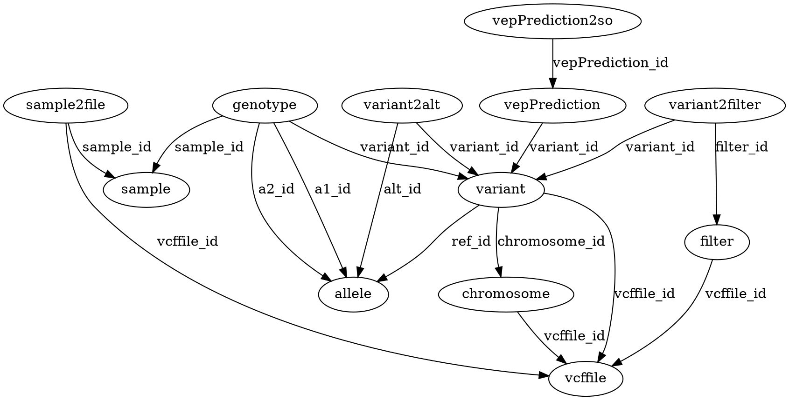

# VcfToSql


Generate the SQL code to insert a VCF into mysql


## Usage

```
Usage: vcf2sql [options] Files
  Options:
    -d, --drop
      Add Drop Tables Statement
      Default: false
    -h, --help
      print help and exit
    --helpFormat
      What kind of help. One of [usage,markdown,xml].
    -f, --nofilter
      ignore FILTER column
      Default: false
    -n, --noinfo
      ignore INFO column
      Default: false
    -o, --output
      Output file. Optional . Default: stdout
    -s, --schema
      Print Schema
      Default: false
    --version
      print version and exit

```


## Keywords

 * vcf
 * sql


## Compilation

### Requirements / Dependencies

* java [compiler SDK 11](https://jdk.java.net/11/). Please check that this java is in the `${PATH}`. Setting JAVA_HOME is not enough : (e.g: https://github.com/lindenb/jvarkit/issues/23 )


### Download and Compile

```bash
$ git clone "https://github.com/lindenb/jvarkit.git"
$ cd jvarkit
$ ./gradlew vcf2sql
```

The java jar file will be installed in the `dist` directory.

## Source code 

[https://github.com/lindenb/jvarkit/tree/master/src/main/java/com/github/lindenb/jvarkit/tools/vcf2sql/VcfToSql.java](https://github.com/lindenb/jvarkit/tree/master/src/main/java/com/github/lindenb/jvarkit/tools/vcf2sql/VcfToSql.java)

### Unit Tests

[https://github.com/lindenb/jvarkit/tree/master/src/test/java/com/github/lindenb/jvarkit/tools/vcf2sql/VcfToSqlTest.java](https://github.com/lindenb/jvarkit/tree/master/src/test/java/com/github/lindenb/jvarkit/tools/vcf2sql/VcfToSqlTest.java)


## Contribute

- Issue Tracker: [http://github.com/lindenb/jvarkit/issues](http://github.com/lindenb/jvarkit/issues)
- Source Code: [http://github.com/lindenb/jvarkit](http://github.com/lindenb/jvarkit)

## License

The project is licensed under the MIT license.

## Citing

Should you cite **vcf2sql** ? [https://github.com/mr-c/shouldacite/blob/master/should-I-cite-this-software.md](https://github.com/mr-c/shouldacite/blob/master/should-I-cite-this-software.md)

The current reference is:

[http://dx.doi.org/10.6084/m9.figshare.1425030](http://dx.doi.org/10.6084/m9.figshare.1425030)

> Lindenbaum, Pierre (2015): JVarkit: java-based utilities for Bioinformatics. figshare.
> [http://dx.doi.org/10.6084/m9.figshare.1425030](http://dx.doi.org/10.6084/m9.figshare.1425030)


## Examples

```bash
java -jar dist/vcf2sql.jar  file.vcf | mysql -u user -p -D vcf_db 
```
## Database schema (dot)


